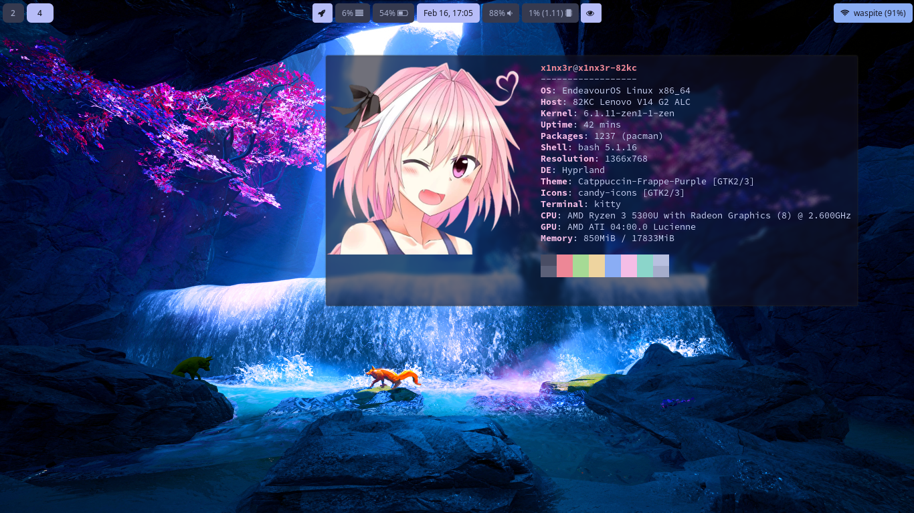

# hypr-catpuccin-dotfiles
Dotfiles for my hyprland catpuccin rice
All of the folder above goes to .config folder

# Prerequisites :
- hyprland (https://hyprland.org/) follow the wiki to install it or just get it from the AUR
- waybar-hyprland-git (https://github.com/Alexays/Waybar) or you could find it in AUR
- rofi (https://github.com/davatorium/rofi) or you could get it from AUR
- kitty (https://github.com/kovidgoyal/kitty) available in both arch repo and AUR
- hyprland catpuccin theme (https://github.com/catppuccin/hyprland) 
- waybar-catpuccin-theme (https://github.com/catppuccin/waybar)
- rofi-catpuccin-theme (https://github.com/catppuccin/rofi) 
- kitty-catpuccin-theme (https://github.com/catppuccin/kitty)

# Screenshoots

